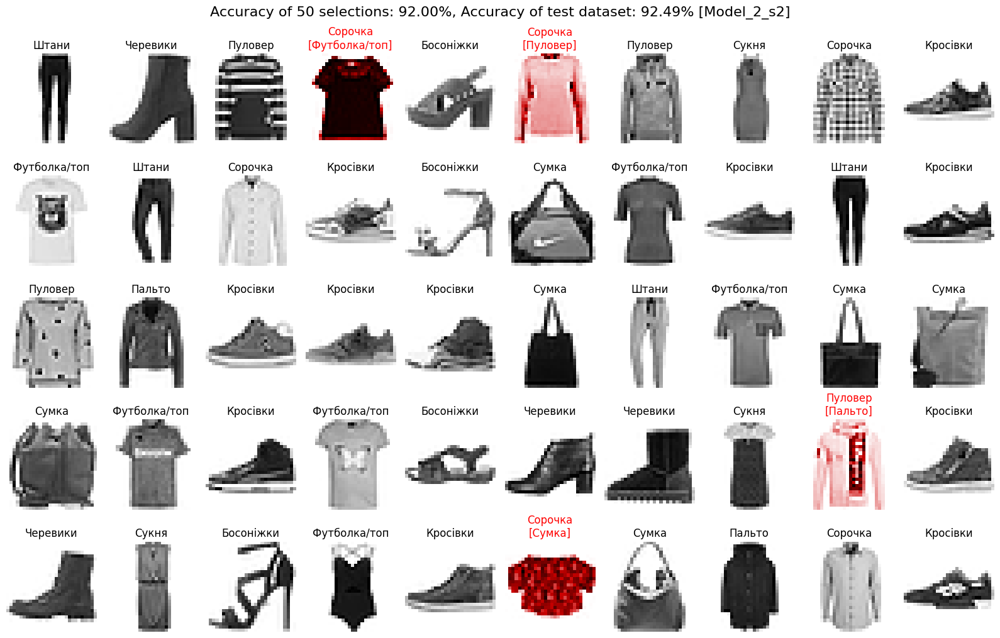
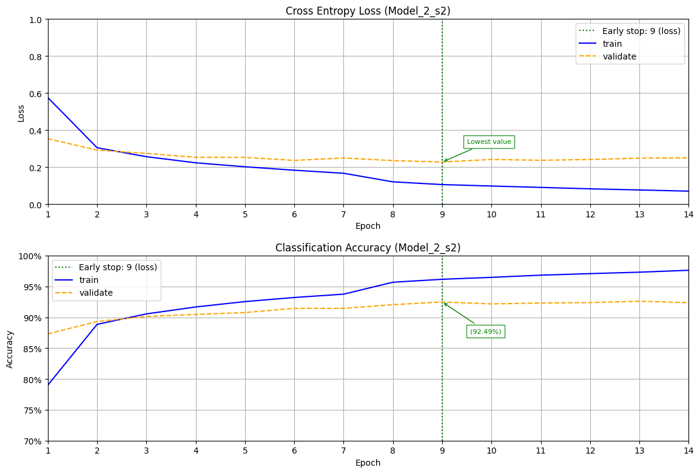
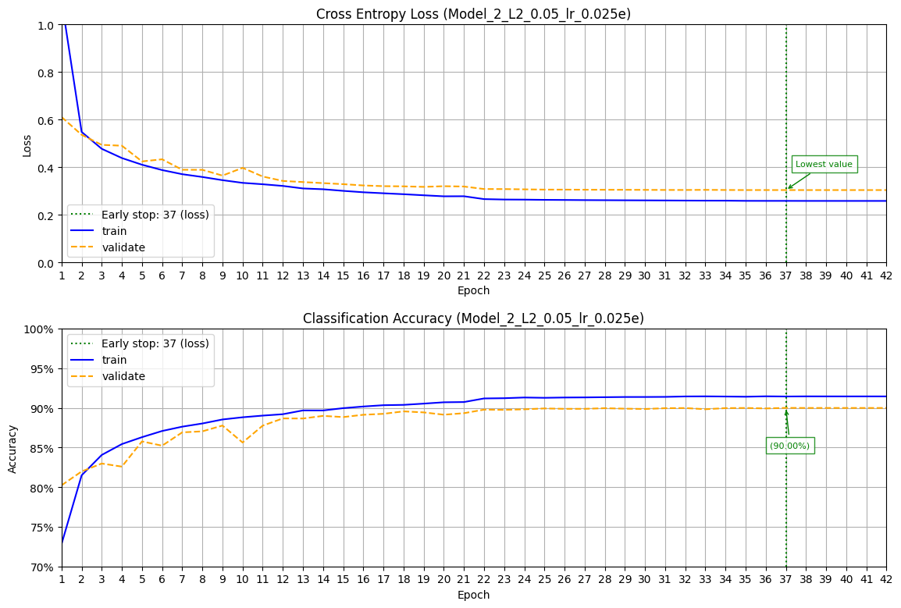
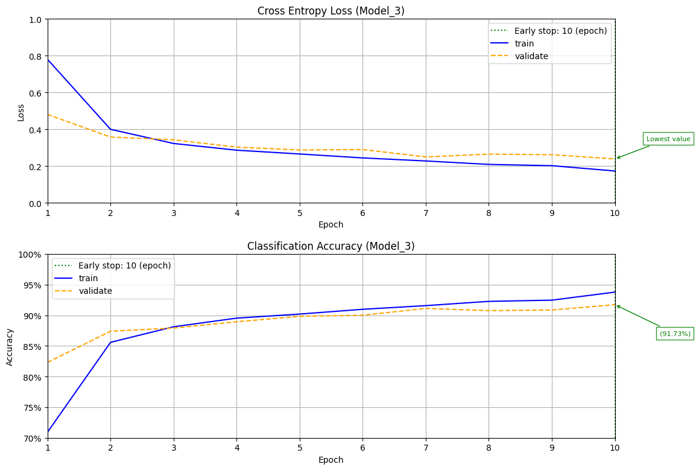
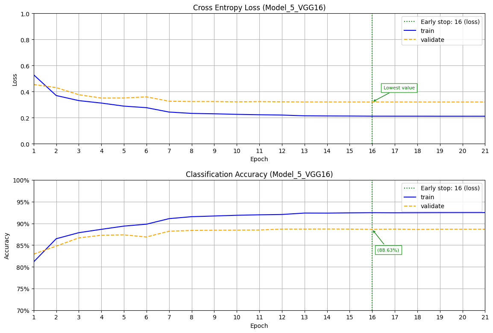
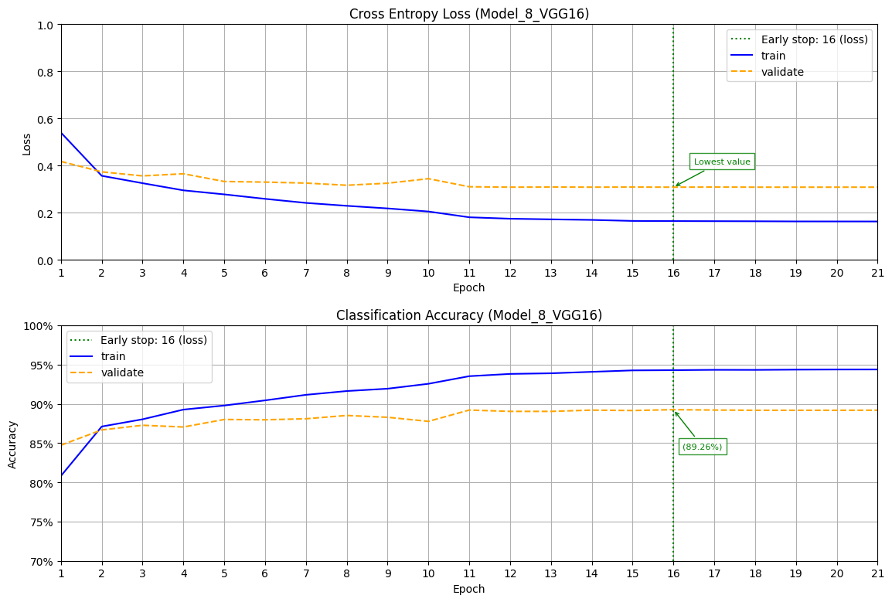
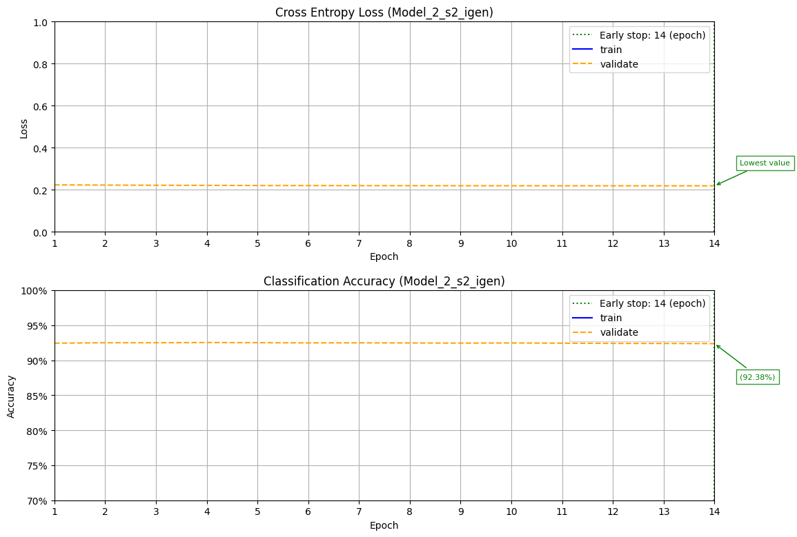
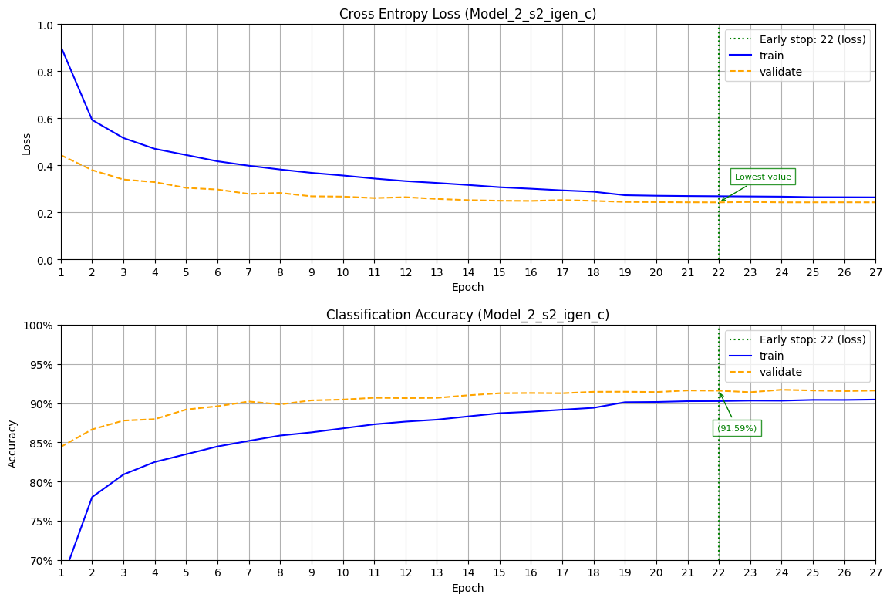
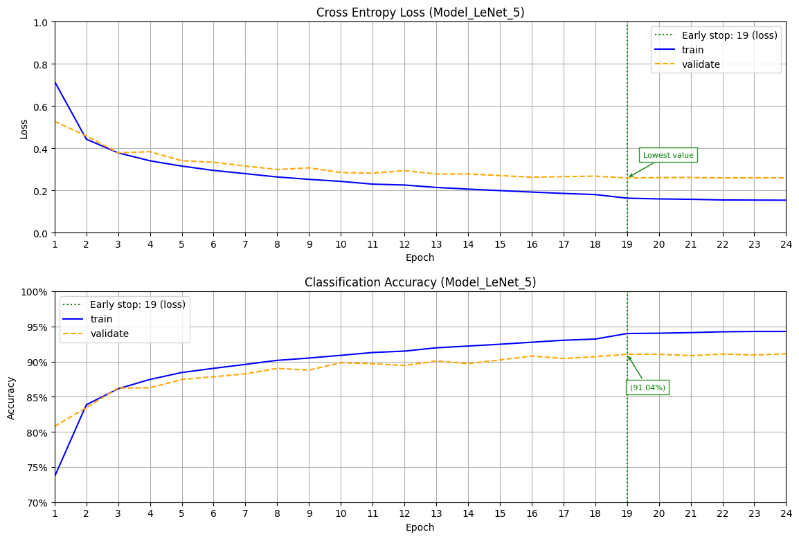
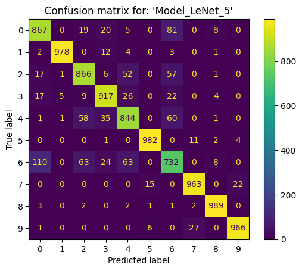

# Модуль 10. Згорткові нейронні мережі. Tensorflow. Keras.

*З циклу [домашніх завдань Python Data Science](https://github.com/lexxai/goit_python_data_sciense_homework).*

# Домашнє завдання

## Частина 1

В якості домашнього завдання вам пропонується створити нейронну мережу за допомогою механізмів Keras, яка буде класифікувати товари із датасету [fasion_mnist](https://www.tensorflow.org/datasets/catalog/fashion_mnist)[fasion_mnist](https://www.tensorflow.org/datasets/catalog/fashion_mnist).

На відміну від попереднього завдання вам пропонується створити згорткову нейромережу. Підберіть архітектуру мережі та навчіть її на даних із датасету fasion_mnist. Спробуйте досягти максимально можливої точності класифікації за рахунок маніпуляції параметрами мережі. Порівняйте точність отриманої згорткової мережі з точністю багатошарової мережі з попереднього завдання. Зробіть висновки.

## Частина 2

В цій частині ми знову будемо працювати з датасетом [fasion_mnist](https://www.tensorflow.org/datasets/catalog/fashion_mnist).

На відміну від попереднього завдання вам пропонується створити згорткову нейромережу, що використовує VGG16 в якості згорткової основи.

Навчіть отриману мережу на даних із датасету fasion_mnist. Спробуйте досягти максимально можливої точності класифікації за рахунок маніпуляції параметрами мережі. Під час навчання використовуйте прийоми донавчання та виділення ознак.

Порівняйте точність отриманої згорткової мережі з точністю багатошарової мережі з попереднього завдання. Зробіть висновки.

# Результати

- [goit_python_ds_hw_10.ipynb](goit_python_ds_hw_10.ipynb)
- [Colab (goit_python_ds_hw_10.ipynb)](https://drive.google.com/file/d/1UZ0mGqIN2Rqcs3OxCcwLOTiLSasm5oT8/view?usp=sharing)
- [models.zip](https://drive.google.com/file/d/1A1bqwSmqWNuChNcpw9SsQm91-AXhxKRZ/view?usp=drive_link)

## Models compare

## Image Predict

## Image Generator

## Learning curves

## Confusion matrix

| Model  | Model  | Model  |
|:------:|:------:|:------:|
|  |  |  |
| Model_1 | Model_2 | Model_2_s2 |
|  |  |  |
| Model_2_L2_0.001 | Model_2_L2_0.05_lr_0.025e | Model_2_L1_0.001_B_256 |
|  |  |  |
| Model_3 | Model_4 | Model_6_VGG16 |
|  |  |  |
| Model_7_VGG16 | Model_8_VGG16 | Model_9_VGG16 |
|  |  |  |
| Model_9_VGG16_SC | Model_10_VGG16_AL | Model_2_s2_igen |
|  |  |  |
| Model_2_s2_igen_c | Model_LeNet_5 |  |

