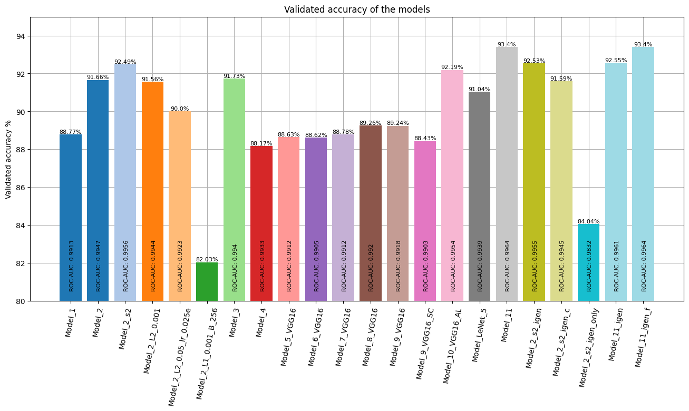
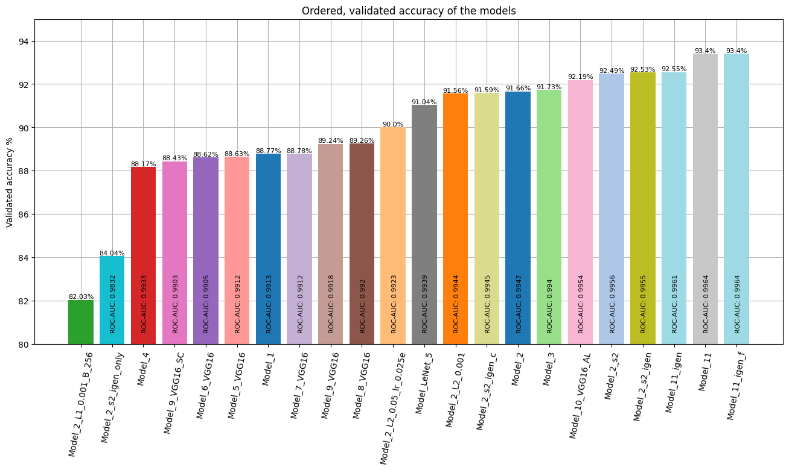
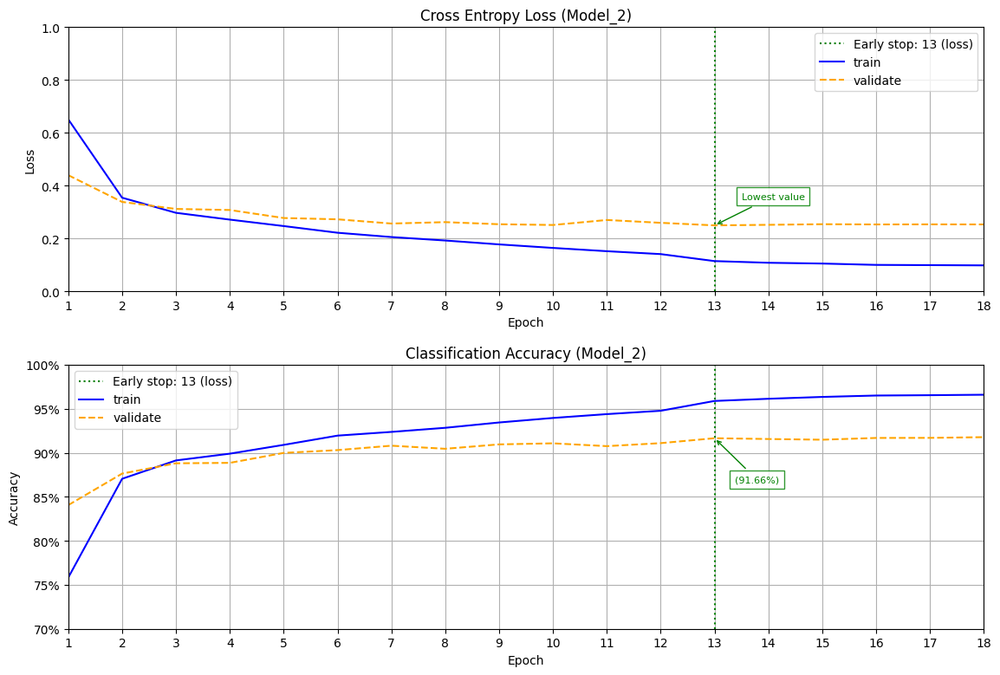
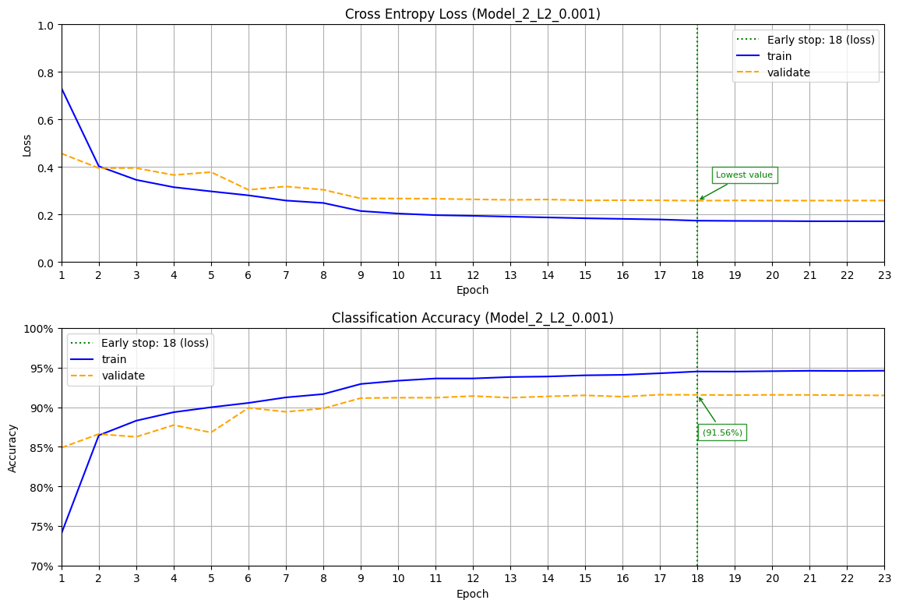
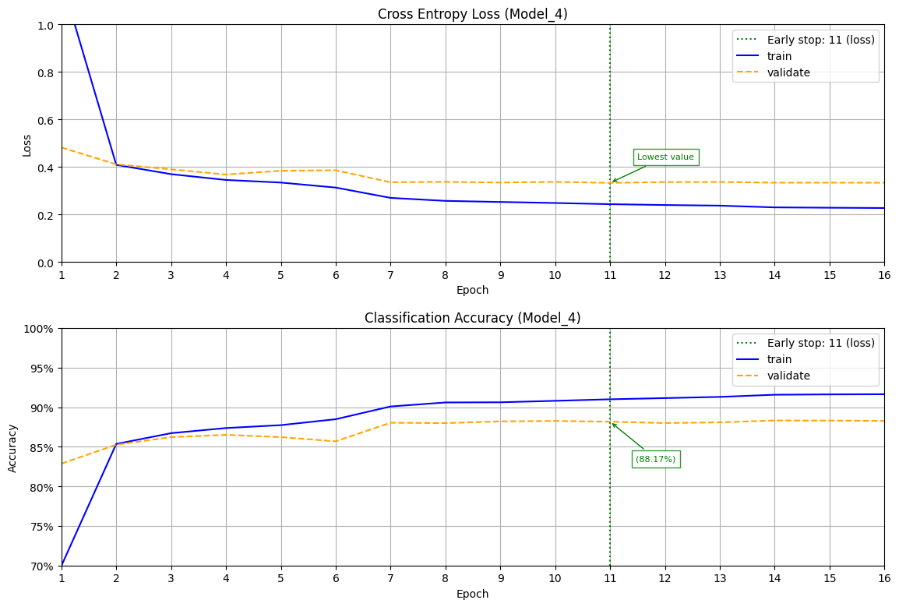
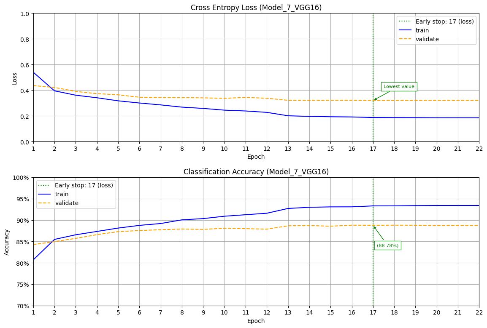

# Модуль 10. Згорткові нейронні мережі. Tensorflow. Keras.

*З циклу [домашніх завдань Python Data Science](https://github.com/lexxai/goit_python_data_sciense_homework).*

# Домашнє завдання

## Частина 1

В якості домашнього завдання вам пропонується створити нейронну мережу за допомогою механізмів Keras, яка буде класифікувати товари із датасету [fasion_mnist](https://www.tensorflow.org/datasets/catalog/fashion_mnist)[fasion_mnist](https://www.tensorflow.org/datasets/catalog/fashion_mnist).

На відміну від попереднього завдання вам пропонується створити згорткову нейромережу. Підберіть архітектуру мережі та навчіть її на даних із датасету fasion_mnist. Спробуйте досягти максимально можливої точності класифікації за рахунок маніпуляції параметрами мережі. Порівняйте точність отриманої згорткової мережі з точністю багатошарової мережі з попереднього завдання. Зробіть висновки.

## Частина 2

В цій частині ми знову будемо працювати з датасетом [fasion_mnist](https://www.tensorflow.org/datasets/catalog/fashion_mnist).

На відміну від попереднього завдання вам пропонується створити згорткову нейромережу, що використовує VGG16 в якості згорткової основи.

Навчіть отриману мережу на даних із датасету fasion_mnist. Спробуйте досягти максимально можливої точності класифікації за рахунок маніпуляції параметрами мережі. Під час навчання використовуйте прийоми донавчання та виділення ознак.

Порівняйте точність отриманої згорткової мережі з точністю багатошарової мережі з попереднього завдання. Зробіть висновки.

# Результати

- [goit_python_ds_hw_10.ipynb](goit_python_ds_hw_10.ipynb)
- [Colab (goit_python_ds_hw_10.ipynb)](https://colab.research.google.com/drive/1B0PLu9-VWxFhLPFP8Md1wE9nVk66-jHa?usp=sharing)
- [models.zip](https://drive.google.com/file/d/1A1bqwSmqWNuChNcpw9SsQm91-AXhxKRZ/view?usp=drive_link)

# Висновки

В ході виконання цього домашнього завдання було створено різноманітні комбінації з використанням  згорткових нейромереж. Для моделей використанні  дані  із датасету fasion_mnist.
Мета була досягти максимально можливої точності класифікації об'єктів. 
Загальна кількість проаналізованих моделей 22, кількість класів 10. Для тренування використано датасет з 60000 записів, для тестування і валідації по 10000 записів. Класи рівномірно розподіленні по датасетам.

## В першій частині роботи отримані наступні результати.
Для порівняння точності отриманої згорткової мережі з точністю багатошарової мережі з попереднього завдання створена "Model_1" яка показала точність 88.77%. 
Серед згорткових нейромереж найкращий результат отримано у "Model_2_s2" - 92.49%, та модель "Model_11"- 93.4%. Але остання модель була створена на основі опису іншої команди, тому у результатах вибрано тільки модель "Model_2_s2".

## В  другій частині домашньої роботи результати націленні на використання моделі "VGG16" в якості згорткової основи для власних моделей.
Розкриті деякі аспекти підготовки даних для використання в моделях. Так є мінімальні умови для використання даних в "VGG16" - це зображення 32х32 пікселя і три канали для кольору. 
Але зображення датасету fasion_mnist - це зображення 28х28 пікселів і один канал для кольору (градації сірого 0-255). 
Тому є кілька варіантів перетворення:
- додавання двох білих пікселів по периметру, щоб отримати 32х32.
- збільшити зображення з 28х28 до 32х32 що є не ціло численне збільшення, тому вибрано двократне збільшення  до 56х56 пікселів.

Також була спроба розв'язати оптимізаційне питання обробляти зображення повного датесету за допомогою операцій пакета NumPy, чи на рівні шарів нейронної мережі.
Якщо датасет завеликий, то є проблема обробити його цілком за допомоги NumPy і без акселерації GPU.

Шари нейронної мережі за можливості зможуть перенести обробку на  GPU акселератор і не покидаючи оперативну пам'ять акселератора між шаровими операціями.
Також були розглянуті питання виділення ознак і до навчання  моделі нейронної мережі.

Найкращі результати отриманні на основі "VGG16"в моделі "Model_10_VGG16_AL" яка показала точність 92.19%. Де було застосовано виділення ознак і до навчання.

##В третій частині розглянути інші моделі, а також робота з аугментованими зображеннями. 

Графічно представлено звіт про навчання всіх моделей, діаграми "confusion matrix", та порівняльні діаграми моделей з даними валідаційної точності та значеннями ROC-AUC. 
Представлено візуальний прогноз для випадкових 50-ти об'єктів з тестового набору зображень.

За допомогою модуля "tensorboard" можна додатково проаналізувати процеси навчання всіх моделей.

Всі моделі та їх результати роботи збереженні у файлах та об'єднанні в один архівний .zip файл котрий зберігається по закінченню обробки всіх моделей, а також проміжний .zip файл за закінченням обробки однієї моделі та зберіганням їх до хмарного сховища даних.

Розрахунки другої частини завдання потребували використання графічного прискорювача, де був використаний акселератор  Nvidia T4 GPU платформи  Google Colab.   Витрачений час для більшості моделей на одну епоху приведено у спису значень.

## Models compare
Total modlels:  22

## RGB Data preparaton for VGG16 models

## Image Predict

## Image Generator

## Learning curves

## Confusion matrix

| Model  | Model  | Model  |
|:------:|:------:|:------:|
|  |  |  |
| Model_1 | Model_2 | Model_2_s2 |
|  |  |  |
| Model_2_L2_0.001 | Model_2_L2_0.05_lr_0.025e | Model_2_L1_0.001_B_256 |
|  |  |  |
| Model_3 | Model_4 | Model_5_VGG16 |
|  |  |  |
| Model_6_VGG16 | Model_7_VGG16 | Model_8_VGG16 |
|  |  |  |
| Model_9_VGG16 | Model_9_VGG16_SC | Model_10_VGG16_AL |
|  |  |  |
| Model_LeNet_5 | Model_11 | Model_2_s2_igen |
|  |  |  |
| Model_2_s2_igen_c | Model_2_s2_igen_only | Model_11_igen |
|  |  |  |
| Model_11_igen_f |  |  |

